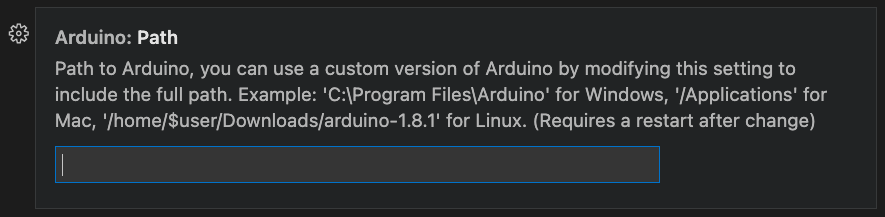

# TAFOM-Arduino

## Development environment for VsCode

### Install the official Arduino extension: 

Name: Arduino \
Id: vsciot-vscode.vscode-arduino \
Description: Arduino for Visual Studio Code \
Version: 0.4.12 \
Publisher: Microsoft \
VS Marketplace Link: https://marketplace.visualstudio.com/items?itemName=vsciot-vscode.vscode-arduino

### Set the arduino.path (folder of Arduino app installation):
VsCode -> Settings -> Extensions -> Arduino configuration -> Arduino: path

If these are not set, on the bottom bar of VsCode click on: 

 - \<Select programmer> and choose AVRISP mkII,
 - \<Select board> and choose Arduino Mega or Mega 2560

## Build
Connect the Arduino and click on \<Select Serial Port> (bottom bar),
selecting the serial port that corresponds to it's connection.

With any file ending in .ino open, click on the top right buttons to verify or upload code.
Alternatively, you might click F1 and write the commands "Arduino: Verify" or "Arduino: Upload" and press the Enter key.